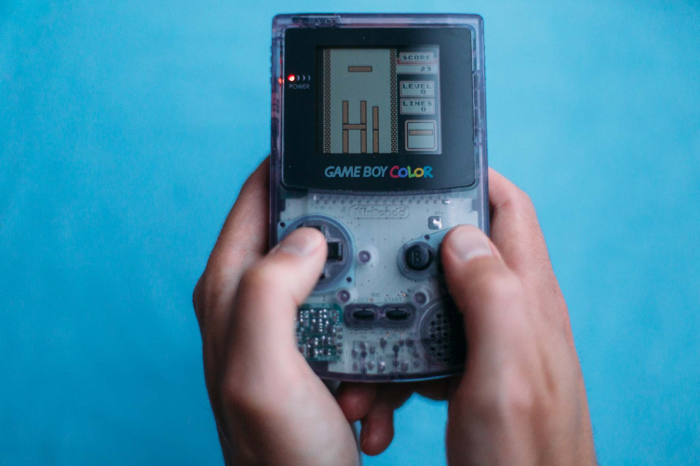

# Itris – straight tetrominoes only in Tetris for Game Boy

> This romhack makes straight tetrominoes the only kind of piece in Tetris for Game Boy.

Itris is a patch, also called a romhack, for the Game Boy version of Tetris. It removes the randomness of the falling tetrominoes and delivers nothing else than straight pieces. Why would anyone want that? I don't know, but realizing the idea was a fun reverse engineering exercise for me.

## Want to play?

You can try this version of Tetris out for yourself in a Game Boy emulator or on real hardware.

1. Get a hold of Tetris ROM file somehow. The SHA-1 should calculate to `74591cc9501af93873f9a5d3eb12da12c0723bbc` for my patch to apply correctly.
2. Rename the ROM file to `tetris.gb` and place in the root directory next to the `Makefile`.
3. Run `make` and you should find the `itris.gb` ROM file in the same directory.
4. Load the ROM in your favorite emulator or copy it over to a flash cartridge to play on real hardware.

## Why this obsession with I pieces?

One hot summer my girlfriend and I went head to head in a Tetris tournament. We dug out a couple of Game Boys, a Game Link Cable and one Game Pak each of the Russian block puzzle game. Game on!

During our battles, when taking a break from taunting each other, we often discussed the peculiarities of the game. One kink surfaced again and again: why is it that the straight pieces never seem to appear when you need them the most?
